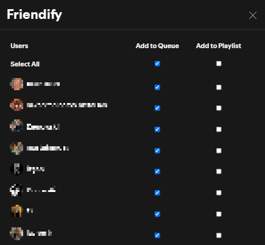

# Friendify-ListenWithYourFriends
***An extension for Spicetify Users for a real-time music sharing and personalized playlist creation to your Spotify experience.***

# Friendify Extension for Spicetify
Hey there, music lover! 🎵
Welcome to **Friendify**, a fun and friendly Spicetify extension that brings your friends' music taste closer to you. With Friendify, you can either save the tracks your friends are listening to in custom playlists or add them directly to your queue. It's all about sharing and discovering new music together!

## Installation Instructions

### 1. Open **Spotify** and navigate to the **Spicetify Marketplace**.

### 2. In the **Extensions** section, search for **"Friendify"**.

### 3. Once you find it, simply click on it to view the extension page.

### 4. Hit the **Download** button to install the extension with just one click.

#### Enjoy sharing and discovering music with friends in real-time!

## Manual Installation Instructions
### 1. Download the Extension
- Copy the provided code and save it in a new JavaScript file (`friendify.js`).
### 2. Place the File
- Move the saved JavaScript file to the following directory:
  `%appdata%\local\spicetify\Extensions\`
### 3. Apply the Extension
- Open your terminal or command prompt.
- Run the following command to apply the extension:
  `spicetify apply`
## Extension Functionality
The **Friendify** extension mainly lets you:
### Track Friends' Activity
- Stay updated with what your friends are listening to.
- Friendify tracks to your friends' activities and tracks the songs they play.
### Add Tracks to Queue
- Automatically add the songs your friends are enjoying into your queue.
- Enjoy real-time music sharing and vibe together.
### Create Custom Playlists
- Build unique playlists for each friend.
- Save the tracks they listen to in those playlists—it’s like a musical diary of your friends' tastes!
### Notification System
- Get notifications when a track is added to your queue or playlist.
- Always stay in the loop.
## How to Use Friendify
### First Time Using Spicetify?
- **if so;**
- and you're new to **Spicetify**, you'll need to install it before using Friendify.  
Follow the official **[Spicetify installation guide](https://spicetify.app/docs/getting-started/)** to set it up, then return here to continue with the remaining steps.
- **else;**
- Click the **heart icon** in the top left corner of the Friendify window to open the settings menu.
- You'll see a list of your friends along with checkboxes next to their names.
- **To add their tracks to your queue or playlist**, simply check or uncheck the corresponding boxes.
- Changes take effect immediately, so you can customize your experience on the fly!

### Track Friends' Activity
- Friendify fetches your friends' list and tracks their music activity.
- Always know what your friends are jamming to.

### Automatically Add Tracks to Queue
- Choose which friends' tracks you want to add to your queue.
- Toggle the option easily, and their songs will be added to your queue automatically.

### Automatically Create Custom Playlists
- For a more personalized touch, create custom playlists for each friend.
- Friendify will add the songs they listen to into these playlists.

### Display Notifications
- Real-time notifications keep you updated whenever a track is added.
- Never miss a beat!

## Key Functions in the Code
### ActivityManager
- **Tracks friends' activities:** tracks to your friends' music sessions.
- **Adds tracks:** Automatically adds tracks to your queue or to custom playlists.
- **Displays notifications:** Keeps you informed when new tracks are added.
Enjoy the musical journey with your friends, and happy listening! 🎶  
If you find any bugs or need help or tweaks, just let me know! :)
